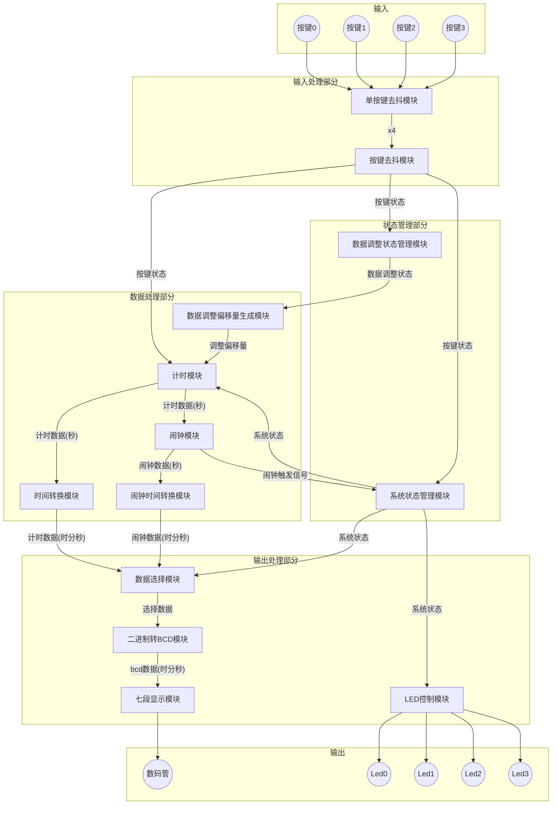
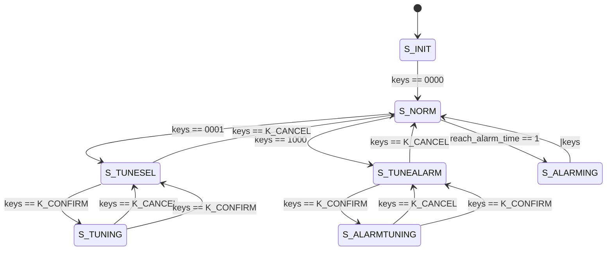
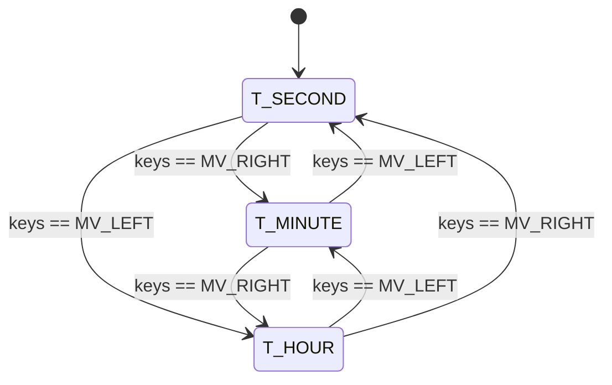

# 基于Xillinx FPGA的数字时钟实现

博客地址: [待完善]()

## 特性

- 时钟显示
- 时间调节
- 闹钟设定
- 闹钟响铃（LED闪烁/蜂鸣器）

## 环境

- 正点原子达芬奇FPGA开发板(xc7a35tfgg484)
- Vivado 2022.2
- ModelSim

## 目录结构

- src: 项目的verilog实现
- tb: 项目的测试文件
- cons: 针对每个开发板的约束文件，这里只提供了赛灵思xc7a35t开发板

## 系统原理框图



## 状态转移图

### Sys Status

系统状态

verilog定义如下：
```verilog
parameter S_INIT = 3'd0;
parameter S_NORM = 3'd1;
parameter S_TUNESEL = 3'd2;
parameter S_TUNING  = 3'd3;
parameter S_TUNEALARM = 3'd4;
parameter S_ALARMTUNING = 3'd5;
parameter S_ALARMING = 3'd6;
```

- S_INIT: 初始化状态
- S_NORM: 标准状态，初始化后默认为此状态，时钟正常计时
- S_TUNESEL: 时间调整单位选择状态，可选小时、分钟、秒 (与Tune Status相关)，时钟停止计时
- S_TUNING: 时间调整状态，选择好要调整的为小时/分钟/秒后，进入调整，时钟停止计时
- S_TUNEALARM: 闹钟时间设置单位选择状态，可选小时、分钟、秒 (与Tune Status相关)，时钟正常计时
- S_ALARMTUNING: 闹钟时间设置状态，选择好要设置的为小时/分钟/秒后，进入设置，时钟正常计时
- S_ALARMING: 闹铃触发状态，当时间与设定的闹钟时间相同时进入，此时LED频闪，时钟正常计时



### Tune Status

在Sys Status为S_TUNESEL或者S_TUNEALARM时进入，用于选择小时、分钟、秒进行调整/设置。

Verilog定义如下
```verilog
parameter T_NONE = 2'd0;
parameter T_HOUR = 2'd3;
parameter T_MINUTE = 2'd2;
parameter T_SECOND = 2'd1;
```

- T_NONE: 当Sys Status不为S_TUNESEL或者S_TUNEALARM时，将状态置为None
- T_HOUR、T_MINUTE、T_SECOND: 调整/设置小时、分钟、秒，可通过左右移动按键来进行选择



## 参考资料
- [正点原子官方开发手册（数码管显示部分）](http://47.111.11.73/docs/boards/fpga/zdyz_dafenqi.html)
